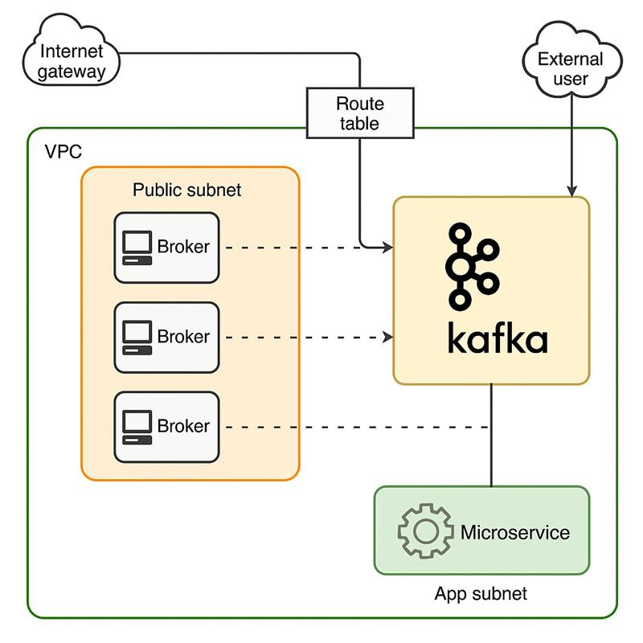

# Kafka-cluster


# 🔁 Real-Time Kafka Dashboard with Streamlit, Terraform & Ansible

A production-grade Kafka-based data pipeline that fetches live cryptocurrency data, pushes it to Kafka brokers, and visualizes it on a real-time dashboard using Streamlit. The entire infrastructure is provisioned using Terraform and configured using Ansible.

 <!-- Add your architecture image here -->
 
---

## 🚀 Features

- Kafka cluster with 3 brokers and replication factor 3
- Zookeeper ensemble for broker coordination
- Python-based Kafka producer fetching BTC price from Binance
- Streamlit consumer visualizing live data on a dashboard
- DNS-based routing via Route 53
- Infrastructure-as-Code with Terraform
- Configuration automation with Ansible
- Streamlit and Producer services managed via `systemd`

---

## 🛠️ Tech Stack

| Layer        | Technology                      |
| ------------ | ------------------------------- |
| Infra        | AWS EC2, Route 53               |
| IaC          | Terraform                       |
| Config Mgmt  | Ansible                         |
| Messaging    | Apache Kafka, Zookeeper         |
| Backend      | Python (producer & consumer)    |
| Dashboard    | Streamlit                       |
| DNS Routing  | AWS Route 53                    |
| OS           | Amazon Linux 2023 / RHEL        |
 
---

## 🧩 Architecture

```text
┌────────────┐     ┌──────────────┐
│  Producer  │──▶──│ Kafka Broker │
└────────────┘     └──────────────┘
        ▲                ▲
        │                │
┌──────┴──────┐   ┌─────┴──────┐
│ Zookeeper 1 │...│ Zookeeper N│
└─────────────┘   └────────────┘
 
Streamlit Dashboard pulls messages from Kafka via DNS


